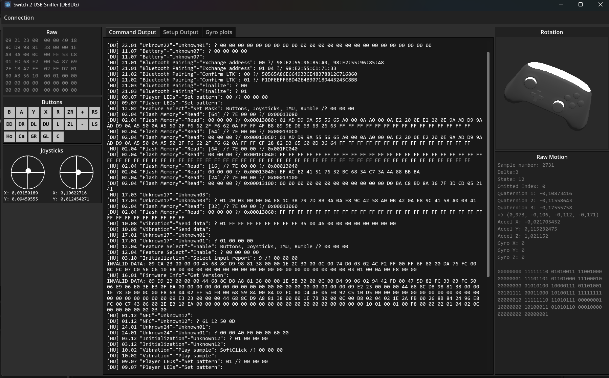

# Switch2USBSniffer

This is a small tool i had made to figure out motion data for my PIMU project.

To use:
1. install the `pico_usb_sniffer.uf2` (obtained from https://github.com/tana/pico_usb_sniffer) on a pico
2. Connect the pico to intercept any packages from a usb connection between the switch 2 and a controller
	1. USB D- goes to GPIO 11
	2. USB D+ goes to GPIO 12
	3. USB GND goes to GND
3. Connect the pico to the PC
4. Start the app and connect to the picos assigned COM channel

> ![WARNING]
> The code in this was hastily put together and is, at least by my personal standards, horrible. I do not recommend using this as reference for production level projects - and if you do, do so at your own risk. 
> The USB link layer code especially is a hot mess, but it does the job good enough to inspect the most important communication.